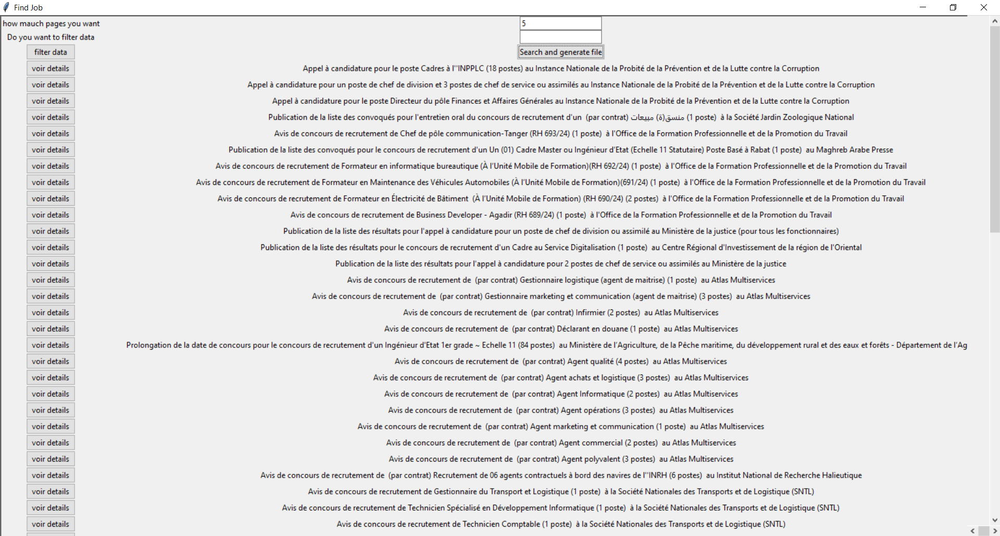

# Overview

- User-friendly desktop application that helps Moroccan job seekers find and apply for positions in the public sector by providing a streamlined interface to access job listings and filter opportunities.

# Features

- **Web Scraping**: Utilizes `BeautifulSoup` to scrape job listings from relevant Moroccan government websites or public sector job portals.
- **Data Extraction**: Extracts key information such as job titles, descriptions, application deadlines, and required qualifications.

# User Interface:

- **Main Window:** Built using Tkinter to provide an intuitive and visually appealing interface.
- **Job Listings Display:** Uses Tkhtmlview to render HTML content, allowing users to view job descriptions and details in a formatted manner.

# Search and Filtering:

- **Search Functionality**: Users can search for job positions using keywords.

# Data Management:

**Data Storage:** Uses Pandas for managing and analyzing job listings data.
**Export:** Users can export their jobs to CSV file for offline access or record-keeping.

# Technologies Used

- **Python3:** The programming language used for the development of the application.
- **BeautifulSoup:** A library used for web scraping to gather job listings from public sector websites.
- **Tkinter:** The GUI toolkit for creating the desktop application interface.
- **Tkhtmlview:** A library for rendering HTML content within the Tkinter interface, allowing users to view formatted job descriptions.
- **Pandas:** Utilized for data manipulation and management, particularly for storing and processing job listings data.

# Results

#### First window:

#### Second window:
